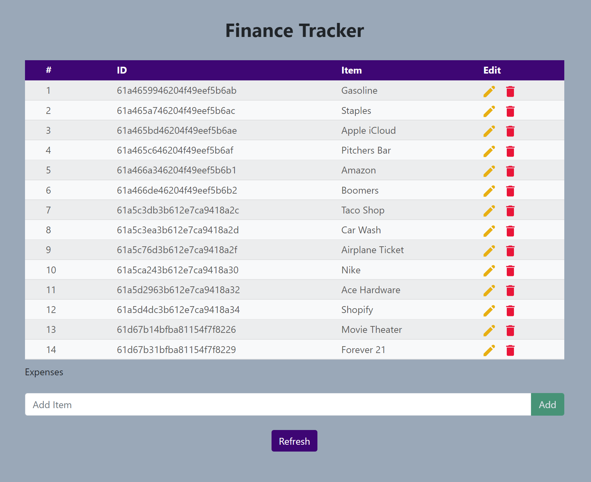

# Finance Tracker

An CRUD application for users to keep of their expenses.  Uses spring boot for the backend API, React as the frontend, and mongoDB as the database.

## Built With:
#### React.js
#### Java Spring Boot
#### MongoDB

## Deployed On:
#### Heroku

[Backend Source Code](https://github.com/echoaj/FinanceTrackerBackend)
